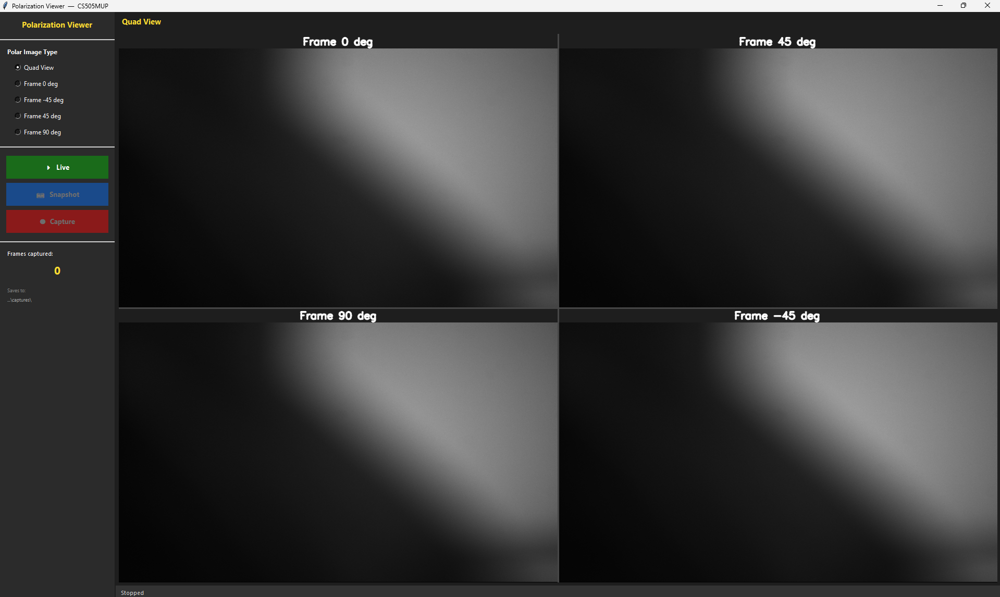
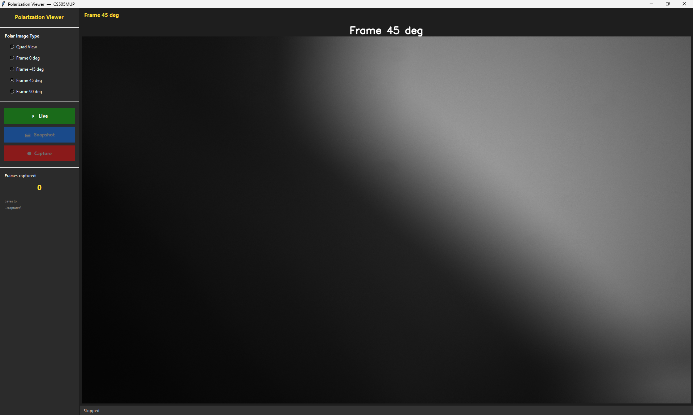

# Polarization Quad Viewer
 
A lightweight Python GUI for Thorlabs polarization cameras.
Live-streams and saves the four polarization channels — **0°, 45°, 90°, -45°** — separately,
with a sidebar to switch between quad view and individual channels.
 
Developed and tested with the **Thorlabs CS505MUP** polarization camera. Download ThorImageCAM and the SDK
from [thorlabs.com/software-pages/thorcam](https://www.thorlabs.com/software-pages/thorcam/).
 
> The DLL files included in `ThorImageCam/` are proprietary files from **Thorlabs, Inc.**,
> redistributed here for convenience. This project is not affiliated with or endorsed by Thorlabs.
 
---
 
## Screenshots
 


 
---
 
## Setup
 
**1. Install dependencies**
```bash
py -m pip install opencv-python Pillow
```
 
**2. Install the Thorlabs Python SDK**
```bash
py -m pip install "C:\YOUR_DIRECTORY\thorlabs_tsi_camera_python_sdk_package.zip"
```
> This zip is included with your Thorlabs Scientific Camera SDK installation.

 
**3. Set your paths in the script**
```python
MANUAL_DLL_PATH = r"C:\YOUR_DIRECTORY\ThorImageCam"
SAVE_DIR        = r"C:\YOUR_DIRECTORY\ThorImageCam\captures"
```
 
**4. Close ThorImageCAM, then run**
```bash
cd ThorImageCam
py polarization_quad_viewer.py
```
 
---
 
## Usage
 
Select a view from the sidebar, then use the three buttons:
 
| Button | Action |
|--------|--------|
| **Live** | Start / stop live stream |
| **Snapshot** | Save current frame (4 PNGs) |
| **Capture** | Record every frame until stopped |
 
Files are saved to `ThorImageCam/captures/`, named by timestamp or frame number.